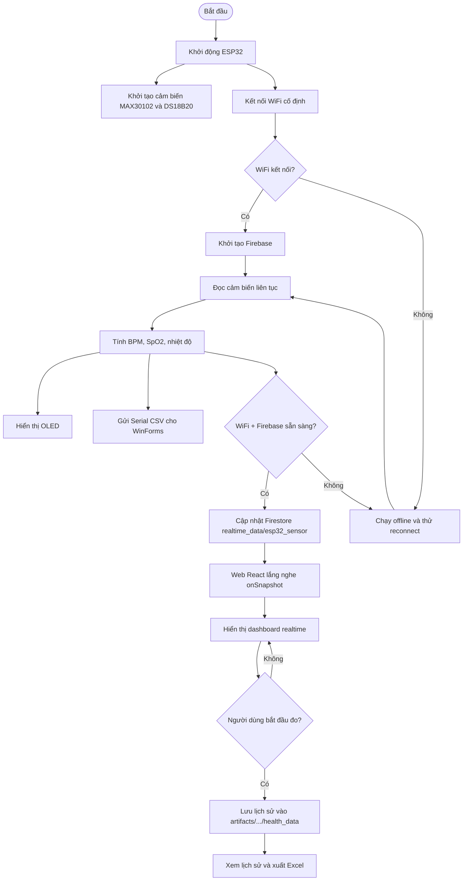
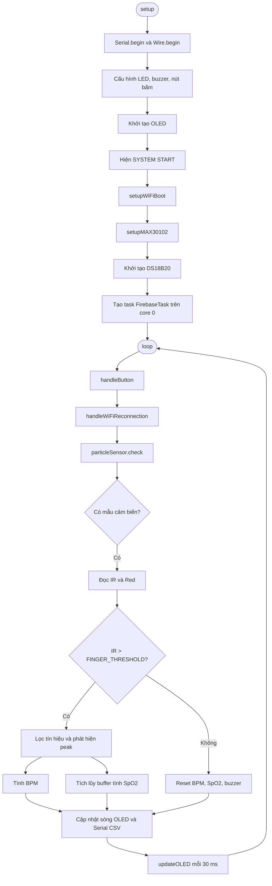
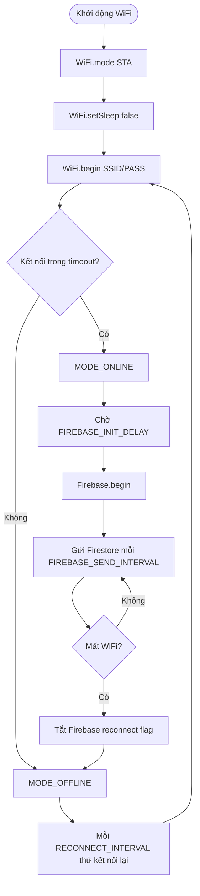
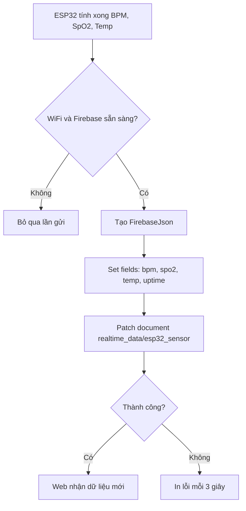
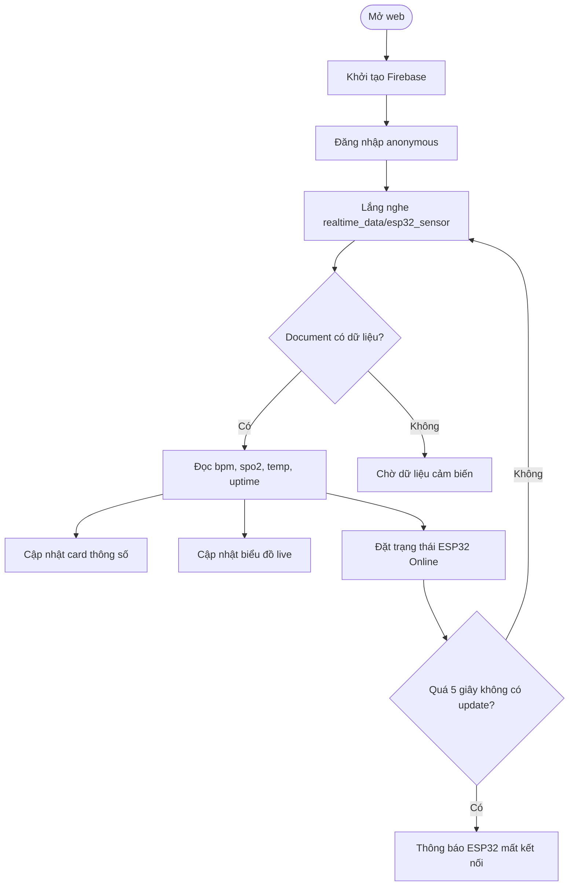
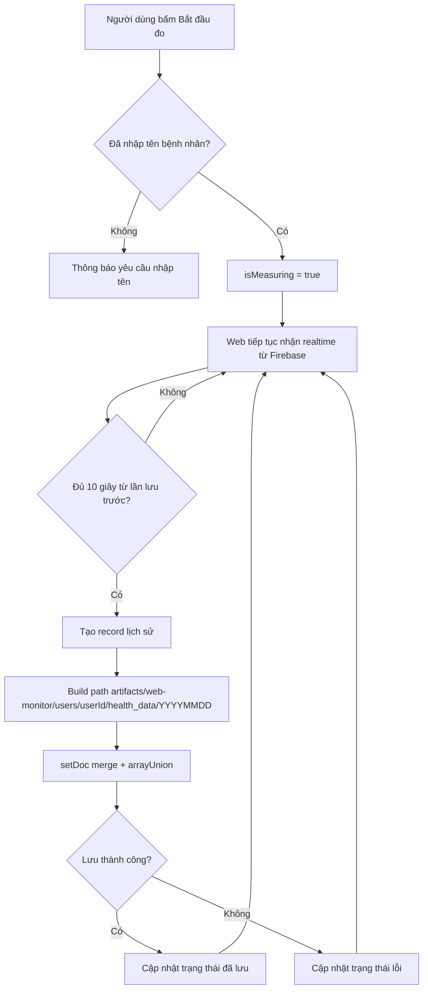
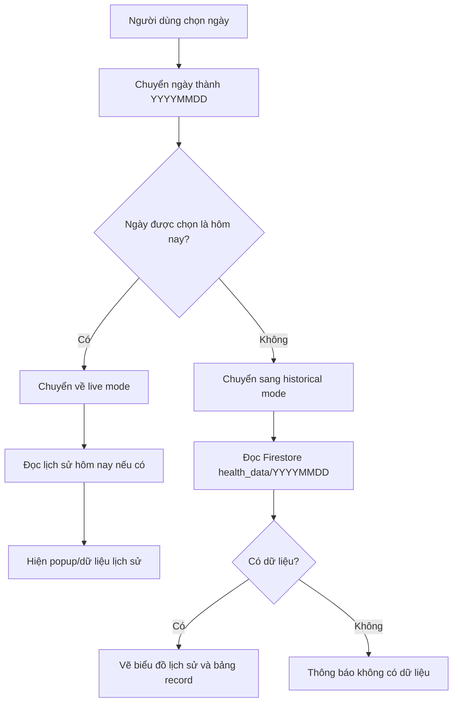
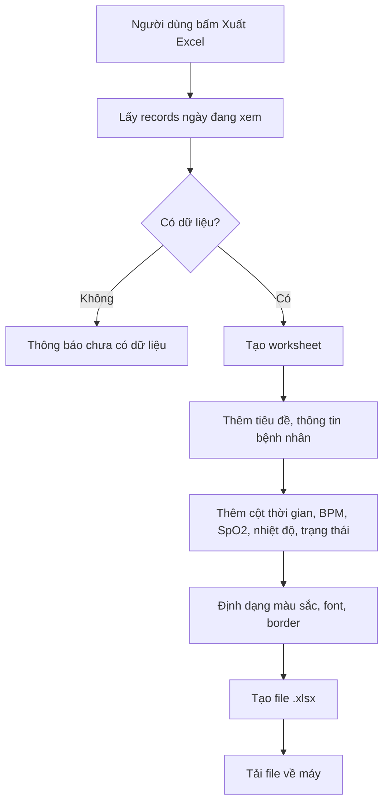
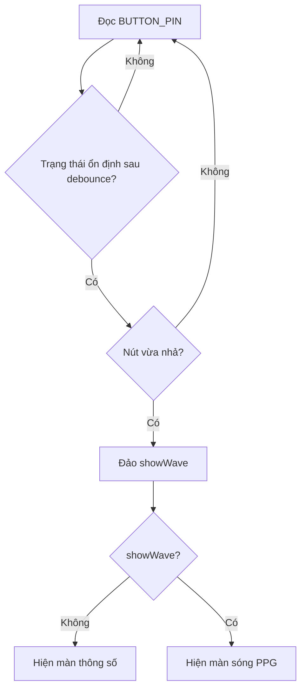

# Lưu Đồ Hệ Thống Giám Sát Sức Khỏe

Tài liệu này tóm tắt các luồng xử lý chính của hệ thống hiện tại.

## 1. Lưu Đồ Tổng Quan

## 2. Lưu Đồ Firmware ESP32

## 3. Lưu Đồ WiFi Và Firebase Trên ESP32

## 4. Lưu Đồ Gửi Dữ Liệu Realtime

## 5. Lưu Đồ Web React Nhận Realtime

## 6. Lưu Đồ Lưu Lịch Sử

## 7. Lưu Đồ Chọn Ngày Và Xem Lịch Sử

## 8. Lưu Đồ Xuất Excel

## 9. Lưu Đồ Nút OLED

## 10. Ghi Chú Cho Báo Cáo

- ESP32 là nút thu thập và xử lý tín hiệu cảm biến.
- Firestore là lớp trung gian realtime giữa ESP32 và web.
- Web vừa hiển thị realtime, vừa lưu lịch sử theo người dùng.
- WinForms đọc trực tiếp Serial CSV để hiển thị sóng và chỉ số.
- Hệ thống phù hợp mục đích giám sát/tham khảo, không thay thế thiết bị y tế chuyên dụng.
